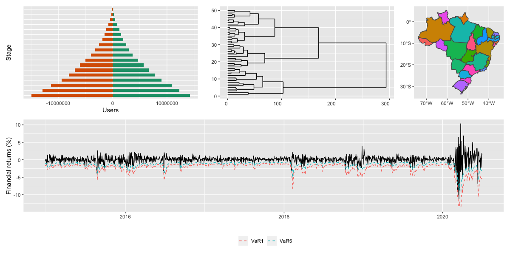

<center>

```{r echo = FALSE, out.width = "100%"}

```

```{r, echo = FALSE}
library(metathis)
meta() %>%
  meta_description(
    "Grupo de Estudos CIA: Causal Inference and Analytics"
  ) %>% 
  meta_name("github-repo" = "ctruciosm.github.io/CIA") %>% 
  meta_viewport() %>% 
  meta_social(
    title = "Grupo de Estudos CIA",
    url = "https://ctruciosm.github.io/CIA",
    image = "imagens/CIA.png",
    image_alt = "Gráficos relacionados com análise de dados",
    og_author = "Carlos Trucíos",
    og_type = "website",
    og_locale = "pt_BR",
    twitter_card_type = "summary"
  )
```


Bem-vindo(a)s ao grupo de estudos **CIA**. O grupo foi fundado ao final do 2020.1 (remoto), após finalizar minha primeira turma como professor de *modelos de regressão e previsão* na FACC/UFRJ. 

A ideia do grupo é reunir aluno(a)s da FACC/UFRJ interessados em métodos quantitativos e análise de dados para estudarmos tópicos relacionados com o Software [R](https://www.r-project.org), Statistical/Machine Learnig, Econometria, _Marketing Analytics_, _People Analytics_, Python, Inferência Causal, etc... _i.e._ com Métodos Quantitativos. O interesse do grupo é entender como os diversos métodos funcionam e como eles são aplicados em diversas áreas.


> `r emo::ji("pencil")` Para participar, preencha o seguinte [**formulário**](https://forms.gle/1Np4NEGbDKMSb9WN9). `r emo::ji("pencil")`


</center>

### *Quando e onde?*

- `r emo::ji("calendar")` Sextas-feiras (a cada quinze dias) das 17hrs às 18hrs (ver cronograma).
- `r emo::ji("personal")` As reuniões acontecem via **Google Meets**.
- `r emo::ji("password")` O link das reuniões será enviado por email unicamente aos participantes.


### *Quem pode participar?*

- `r emo::ji("student")` Qualquer aluno(a) da FACC/UFRJ^[Sempre e quando não tenha aula nos dias/horarios das reuniões.] com desejo de aprender e ensinar.

### *Como funciona o grupo?*

- O grupo é colaborativo e participativo, ou seja, todos os integrantes podem (e devem) falar de algum assunto.
- Os tópicos são relacionados com métodos quantitativos (estatística, econometria, _machine learning_, finanças quantitativas, etc).
- Os tópicos selecionados serão ministrados por mim ou pelos próprios participantes tendo estes últimos minha ajuda.
- Até final do ano, estudaremos o livro [An Introduction to Statistical Learning: with Applications in R](https://www.statlearning.com)

###  *Livros Estudados*

- [**Finalizado**] Wickham, H., \& Grolemund, G. (2016). R for data science: import, tidy, transform, visualize, and model data. " O'Reilly Media, Inc.". 
- [**Em andamento**] James, G., Witten, D., Hastie, T., \& Tibshirani, R. (2013). An Introduction to Statistical Learning: with Application in R. New York: Springer.


###  **Cronograma**^[Tópicos e datas podem mudar] 


| Reunião  | Tópico                          | Data       |  
|:------:|:--------------------|:----------:|
|01       | Intro e comandos básicos  | 26/03/2021  |  
|02       | Visualização de Dados com R   | 09/04/2021  | 
|03       | Manipulação de dados  | 16/04/2021  |  
|04       | Importação de dados e criação da ABT^[ABT: Analytical Base Table]  | 23/04/2021  |
|05       | Introdução à Programação com R  |  20/04/2021 |    
|06       | Fazendo apresentações com Rstudio  | 07/05/2021  |  
|         |  **Fim do Crash Course do R**  |   |
|07       | [Machine/Statistical Learning: Introdução (ISLR Chapter 1 e 2)](http://ctruciosm.github.io/ISL/ISL_01)    | 21/05/2021  |
|08       | [KNN (ISLR Chapter 2)](http://ctruciosm.github.io/ISL/ISL_02)  | 11/06/2021  |     
|09       | [Linear Regression (ISLR Chapter 3)](http://ctruciosm.github.io/ISL/ISL_03)   | 18/06/2021  |   
|         |  **Fim do Período 2020.2**  |   |
|10       | [Classification Part I (ISLR Chapter 4)](http://ctruciosm.github.io/ISL/ISL_04)   | 02/07/2021  |     
|11       | Classification Part II (ISLR Chapter 4)  | 16/07/2021  |     
|12       | Resampling Part I (ISLR Chapter 5)  | 30/07/2021  |     
|13       | Resampling Part II (ISLR Chapter 5)  | 13/08/2021  |     
|14       | Model Selection (ISLR Chapter 6)  | 27/08/2021  |     
|15       | Regularization (ISLR Chapter 6)  | 10/09/2021  |     
|16       | Beyond Linearity Part I (ISLR Chapter 7)  | 24/09/2021  |     
|17       | Beyond Linearity Part II (ISLR Chapter 7)   | 08/10/2021  |     
|18       | Tree-Based Methods Part I (ISLR Chapter 8)   | 22/10/2021  |     
|19       | Tree-Based Methods Part II (ISLR Chapter 8)   | 05/11/2021  |     
|20       | Support Vector Machines (ISLR Chapter 9)   | 19/11/2021  |     
|21       | Principal Component Analysis (ISLR Chapter 10)   | 03/12/2021  |     
|22       | Clustering Methods (ISLR Chapter 10)   | 17/12/2021  |     


#### Nota

Meus colegas e eu nos esforçamos para levar ensino de qualidade mesmo nos tempos de pandemía e de forma remota. Se você tiver aulas no mesmo dia e horário das nossas reuniões, participe das suas aulas, teremos outras oportunidades para você participar do grupo.
