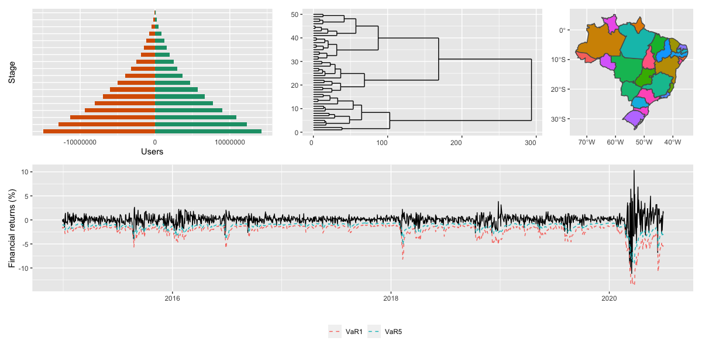

\
\

<center>

# **DASSOS:** **Da**ta **S**cience for **So**cial **S**cience. 

\


```{r echo = FALSE, out.width = "75%"}

```


Olá, seja bem-vindo(a)s ao Grupo **DASSOS**, um grupo de estudos/seminários em métodos quantitativos e ciência de dados aplicados às ciências sociais. O grupo foi fundado ao final do PLE 2020.1, após finalizar minha primeira turma como professor de *modelos de regressão e previsão* na FACC/UFRJ. 

A ideia do grupo é reunir alunos da FACC/UFRJ interessados em métodos quantitativos e análise de dados para estudarmos tópicos relacionados com o Software [R](https://www.r-project.org), análise de dados, Statistical/Machine Learnig, Econometria, _Marketing Analytics_, _People Analytics_, Python, ... _i.e._ com Métodos Quantitativos. O interesse do grupo vai além de entender como os métodos funcionam, mas como eles podem e são utilizados nas ciências sociais. 


</center>


### <span style="color:black"> <b> *Quando e onde?*  </b></span> </br>  

- Sextas-feiras (a cada quinze dias) das 17hrs às 18hrs (ver cronograma).
- As reuniões acontecem via **Google Meets**.
- O link das reuniões será enviado por email unicamente aos participantes.


### <span style="color:black"> <b> *Quem pode participar?*  </b></span> </br>  

- Qualquer aluno(a) da FACC/UFRJ^[Sempre e quando não tenha aula nos dias/horarios das reuniões.] com desejo de aprender e ensinar pode participar.
- Para participar, envie um email a `<carlos.trucios _at_ facc _dot_ ufrj _dot_ br>` (substitua `_at_` por `@` e `_dot_` por `.`) ou preencha o seguinte [**formulário**](https://forms.gle/FhDufKK2qUNiTkgw8).


### <span style="color:black"> <b> *Como funciona o grupo?*  </b></span> </br>

- As primeiras reuniões serão aulas sobre o Software _R_ ministradas por mim (as aulas serão semanais). 
- Após finalizar o curso de _R_, começaremos a discutir tópicos selecionados sobre métodos quantitativos. 
- Os tópicos selecionados serão ministrados por mim e pelos próprios participantes tendo estes últimos minha ajuda.


###  <span style="color:black"> <b> *Cronograma*^[Tópicos e datas podem mudar] </b></span> </br>


| Reunião  | Tópico                          | Data       |  
|:------:|:---------------------|------------|
|01       | Intro e Visualização de Dados com R  | 26/03/2021  |  
|02       | Visualização de Dados com R   | 09/04/2021  | 
|03       | Manipulação de dados  | 16/04/2021  |  
|04       | Importação de dados e criação da ABT^[ABT: Analytical Base Table]  | 23/04/2021  |    
|05       | Introdução à Programação com R  |  20/04/2021 |    
|06       | Introdução à Programação com R  | 07/05/2021  |    
|07       | Machine/Statistical Learning: Introdução   | 21/05/2021  |     
|08       | Redução de dimensão: Análise de Componentes Principais  | 04/06/2021  |     
|09       | Classificação: Regressão Logistica  | 18/06/2021  |      
|10       | Clusterização: K-means  | 02/07/2021  |     
|11       | Classificação: KNN  | 16/07/2021  |     
|12       | Regras de Associação: Algoritmo Apriori  | 30/07/2021  |     
.
.
.


---

#### Nota

Meus colegas e eu nos esforçamos para levar ensino de qualidade mesmo nos tempos de pandemía e de forma remota. Se você tiver aulas no mesmo dia e horário das nossas reuniões, participe das suas aulas, teremos outras oportunidades para você participar do grupo.
