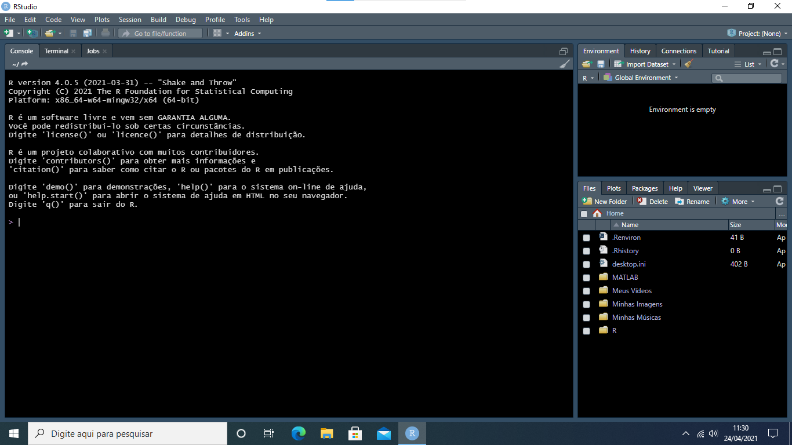
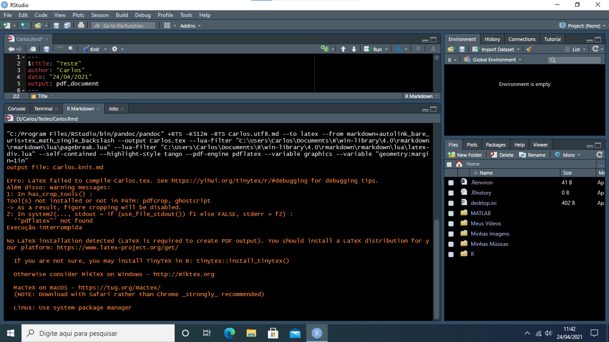
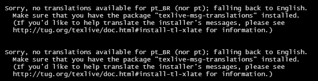

### Introdução

Fazer relatórios técnicos, apresentações e escrever artigos é parte do dia a dia tanto das pessoas envolvidas com  pesquisa quanto das envolvidas com análise de dados. 

Fazer estas tarefas pode ser cansativo e, inclussíve, levar a erros na digitação dos resultados.

Uma forma eficiente e fácil de fazermos isto é misturar a funcionalidade do R com a versatilidade de fazer relatórios utilizando o Rmarkdown.

A seguir, descreverei passo a passo como configurar o Rstudio para poder fazer apresentações/relatórios utilizando o Rmarkdown^[Os passos são bem intuitivos e a maioria de pessoas talvez não precise deste tutorial, mas, caso alguém precisar, deixo aqui o passo a passo].


### Passo a Passo

Se é a primeira vez que está tentando fazer um relatório/apresentação e está em dúvida sobre como proseguir, segue um passo e passo detalhado


#### Passo 1

Quando abrir o Rstudio, verá uma tela semelhante com essa aqui:

```{r echo=FALSE, out.width = '100%'}

```


#### Passo 2

Crie um script markdown:

```{r, eval = FALSE}
File > New File > R Markdown
```

```{r echo=FALSE, out.width = '100%'}
knitr::include_graphics("./im/002.png")
```

Assim que criar o script aparecerá a seguinte mensagem

```{r echo=FALSE, out.width = '100%'}
knitr::include_graphics("./im/003.png")
```

basta clicar em `Yes` e deixar que todos os pacotes sejam instalados (você verá algo como a tela a seguir).

```{r echo=FALSE, out.width = '100%'}
knitr::include_graphics("./im/004.png")
```


#### Passo 3


Após instalar todos os pacotes, tente mais uma vez criar o script

```{r, eval = FALSE}
File > New File > R Markdown
```

Por padrão, a opção `Document` estará ativa e se tudo estiver certo, você verá na tela o seguinte:

```{r echo=FALSE, out.width = '100%'}
knitr::include_graphics("./im/005a.png")
```

se você escolher a opção `Presentation`, verá a seguinte:


```{r echo=FALSE, out.width = '100%'}
knitr::include_graphics("./im/005b.png")
```

Em ambas as opções você pode escolher como fará o relatório/apresentação (html, pdf ou word/power point). Escolha a opção PDF ou PDF (Beamer)^[Pode escolher qualquer outra opção mas eu prefiro fazer em PDF. Ah, eu nunca testei a opção word/power point mas deveria funcionar]

#### Passo 4

Independente da opção escolhida (`Document` ou `Presentation`) aparecerá um template pronto para rodar. Basta você clicar no botão `Knit`

```{r echo=FALSE, out.width = '100%'}
knitr::include_graphics("./im/006.png")
```

(esse botão é para compilar tudo o escrito no seu relatório/apresentação e utilizará ele frequentemente)


Se você for usuário de `Latex`, já deve ter o `miktex` instalado e o Rmarkdown deveria funcionar normalmente. Caso não seja usuário de `Latex`, continue com os próximos passos.

#### Passo 5

Quando apertar o botão pela primeira vez, caso você não tenha instalado antes o `miktex`, o arquivo não compilará e aparecerá algo parecido com:

```{r echo=FALSE, out.width = '100%'}

```

O que importa para nós é a seguinte mensagem:

```{r echo=FALSE, out.width = '100%'}
knitr::include_graphics("./im/008.png")
```

Ou seja, precisamos instalar mais algumas coisinhas antes de podermos fazer apresentações/relatórios utilizando o Rstudio.

Basta rodar o comando

```{r, eval = FALSE}
tinytex::install_tinytex()
```

que tudo o necessário será instalado (você verá uma janela como a seguinte)

```{r echo=FALSE, out.width = '100%'}
knitr::include_graphics("./im/009.png")
```


#### Passo 6

Assim que a instalação anterior tiver terminado, aparecerá a seguinte mensagem

```{r echo=FALSE, out.width = '100%'}

```

mas não se preocupe, apenas ignore.


#### Passo 7

Pronto! já pode utilizar o Rstudio para fazer relatórios. Para testar, aperte o botão `knit`

```{r echo=FALSE, out.width = '100%'}
knitr::include_graphics("./im/006.png")
```

e o pdf de exemplo será compilado!

```{r echo=FALSE, out.width = '100%'}
knitr::include_graphics("./im/012.png")
```


### Conclusões

- Rstudio é uma excelente IDE para se trabalhar com R, mas agora podemos além de  escrever nosso código, fazer relatórios/apresentações
- Para poder utilizar basta apenas seguir alguns passos simples de configuração
- Se você já tiver instalado o `Latex` no seu computador, pode pular os passos 5 e 6, e ir direto para o passo 7
- Caso não saiba o que é `Latex` (isso significa que não tem o `Latex` nem `miktex` instalados) não se preocupe, basta seguir os passos 5 e 6 que tudo ficará pronto para utilizar o Rstudio para fazer relatórios/apresentações