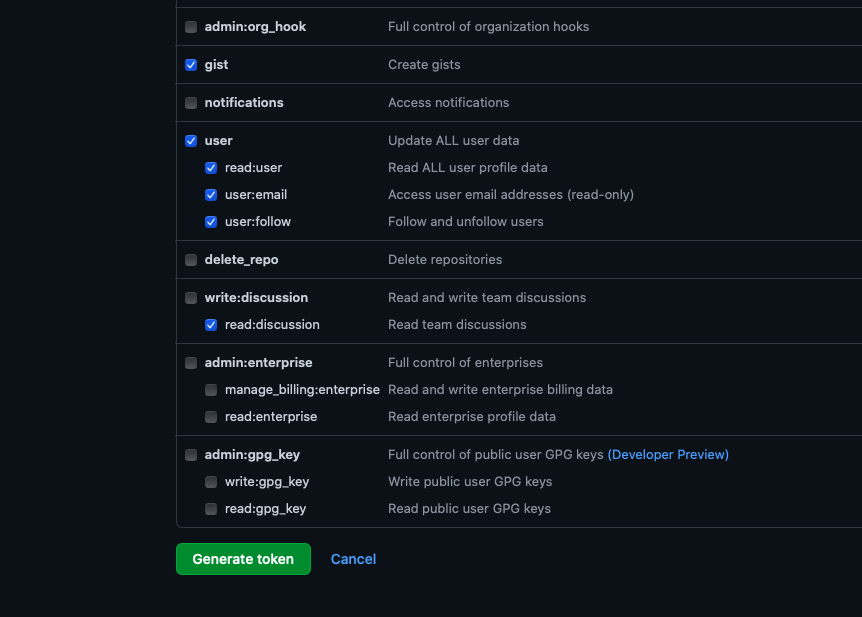
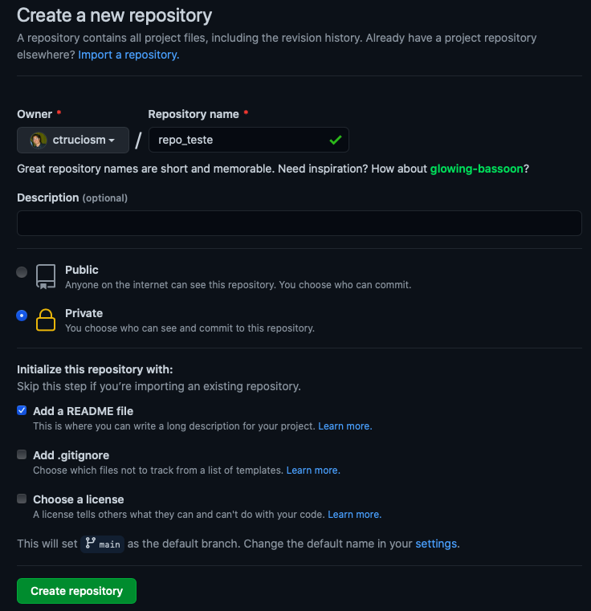
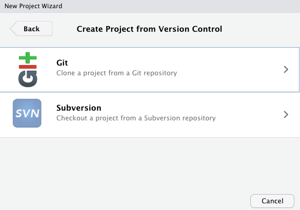

```{r setup, include=FALSE}
knitr::opts_chunk$set(echo = TRUE)
```


### Introdução

Se você escreve código (seja na linguagem que for) sabe que utilizar o Git/GitHub é muito útil. Se você (assim como eu) gosta de usar o Rstudio, talvez esteja interessado(a) em configurar sua conta do Git no Rstudio. 

Esta configuração é algo que é feito apenas uma única vez na vida (ok não na vida, mas uma única vez por computador) e este tutorial vai te guiar no passo a passo.


### Pré-requisitos

Antes de começar, existem algumas coisas que devemos fazer antes (caso ainda não tenha feito):

- Instalar o R [(Baixar aqui)](https://cran.r-project.org)
- Instalar o Rstudio [(Baixar aqui)](https://www.rstudio.com/products/rstudio/download/)
- Criar uma conta no Github [(criar conta aqui)](https://github.com)
- Instalar o Git [(Baixar aqui)](https://git-scm.com/downloads)

### Primeiros Passos

No Rstudio instalar e carregar o pacote `usethis`

```{r, eval=FALSE}
install.packages("usethis")
library(usethis)
```

Para configurar sua conta do Git no Rstudio precisará de um nome de usuário e do email utilizado na conta do Github.

```{r}
usethis::use_git_config(user.name = "nome_usuario_aqui", 
                        user.email = "email_github_aqui@gmail.com") 
```

### Iniciando a configuração

No Rstudio escreva

```{r}
usethis::create_github_token()
```

isto abrirá no seu navegador algo mais ou menos assim:


```{r echo=FALSE, out.width = '100%'}
knitr::include_graphics("./im/001.png")
```


Você pode escrever o nome que você quiser (por exemplo RstudioNotebook, RstudioCasa, etc) mas recomendo que seja um nome que lhe ajude a lembrar para que esse token é utilizado. Eu deixei todos os valores por padrão e no final da página basta clicar em _Generate token_.


```{r echo=FALSE, out.width = '100%'}

```


Logo após, aparecera o token, o qual você precisa copiar (click no icone azul bem do lado do token). Esse token será necessário para terminar a configuração do Git com o Rstudio.

```{r echo=FALSE, out.width = '100%'}
knitr::include_graphics("./im/003.jpeg")
```

Agora escreva

```{r}
usethis::edit_r_environ()
```

O Rstudio abrirá um arquivo chamado .Renviron, nele escreva o token que acabou de ser gerado e depois dê um enter (para pular linha).

```{r echo=FALSE, out.width = '100%'}
knitr::include_graphics("./im/004.png")
```

Salve o arquivo e reinicie sessão (se preferir pode fechar o Rstudio e abri-lo de novo)


```{r, eval = FALSE}
.rs.restartR()
```


> Pronto! Agora já está configurado.


### Vinculando um repositório ao Rstudio

A forma mais fácil de trabalhar com um projeto no Rstudio e que este esteja vinculado ao GitHub é clonando um reposítorio existente. Para isto, precisamos primeiro criar um repositório no GitHub e depois cloná-lo.

#### Criando o repositório no GitHUb

No GitHub, vá na aba `Repositories` e dê clic em `New`

```{r echo=FALSE, out.width = '100%'}
knitr::include_graphics("./im/017.png")
```

Aparecerá a janela abaixo e você pode escolher se criar um repositório público ou privado e se adicionar um _README_ ou nao. Aqui, eu escolhi a opção privado e adicionar _README_. Após escolher as opções da sua preferêcia clic em `Create repository`.


```{r echo=FALSE, out.width = '100%'}

```

Com o repositório criado, dê um clic na setinha do botão `Code` e copie o endereço que aparecer.

```{r echo=FALSE, out.width = '100%'}
knitr::include_graphics("./im/0185.png")
```

#### Clonando o repositorio.

Agora estamos chegando na etapa final. Abra o Rstudio e crie um novo projeto `File > New Project...` e escolha a opção `Version Control`. 


```{r echo=FALSE, out.width = '100%'}
knitr::include_graphics("./im/019.png")
```


Enseguida escolha a opção `Git` e preencha a opção `Repository URL` com o endereço que acabou de copiar do GitHub. Escolha também onde quer criar o projeto no seu computador (no meu caso `/Volumes/CTRUCIOS_SD/Research`). Não esqueça marcar a opção `Open in new session`.


```{r echo=FALSE, out.width = '100%'}

```


```{r echo=FALSE, out.width = '100%'}
knitr::include_graphics("./im/021.png")
```

Clicar em `Create project` e **Pronto!** Seu repositório no GitHub e seu novo projeto do Rstudio estão vinculados, agora é só escrever seus códigos e fazer commits, Push and Pulls.


### Bonus: commit and push

O código que você escreverá no seu computador, ficará unicamente no seu computador. Por isso, não esqueça fazer commit e Push de tempos em tempos para salvar no GitHub seu código mais recente.

Para mostrar como se fazer commit and Push, criei um arquivo chamado `codigo01.R`

```{r echo=FALSE, out.width = '100%'}
knitr::include_graphics("./im/025.png")
```

Para fazer _commit_, vá na aba `Git` e dê clic na opção `Commit`.

```{r echo=FALSE, out.width = '100%'}
knitr::include_graphics("./im/022.png")
```

Agora marque os arquivos que quer subir para o GitHub (no nosso caso, o arquivo `codigo01.R`) e escreva uma breve descrição do que foi feito no código (para você lembrar).

```{r echo=FALSE, out.width = '100%'}
knitr::include_graphics("./im/023.png")
```

Clic em `Commit` e depois clic em `Push`.

Se tudo deu certo, seu código aparecerá no seu repositório do GitHub.

```{r echo=FALSE, out.width = '100%'}
knitr::include_graphics("./im/024.png")
```


**Nota:** Se o arquivo `codigo01.R` não aparecer no GitHub, tente fazer um Push de novo, se lhe pedir usuario e senha, coloque seu nome de usuário do GitHub e quando pedir a senha coloque o token que foi gerado (no começo deste post).

```{r echo=FALSE, out.width = '100%'}
knitr::include_graphics("./im/016.png")
```

Espero ter ajudado. _Happy Coding!_


