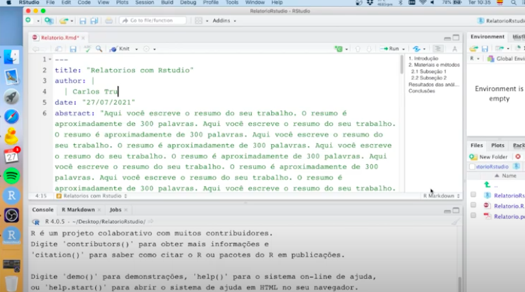

```{r, echo=FALSE}
knitr::include_graphics("rmarkdown.png")
```


### Introdução

Escrever relatórios e artigos científicos são tarefas que fazem parte da vida de todo pesquisador. Alguns preferem utilizar word, que é um editor de texto amplamente conhecido.  Já outros, como eu, preferem utilizar \LaTex que nos permite escrever fórmulas matemáticas de forma fácil e elegante.

Contudo, essas duas opções não são as únicas no mercado. Se você gostar do R/Rstudio, quer utilizar um formato elegante, quer a flexibilidade de trocar entre pdf e word facilmente e ainda quer facilitar sua vida editando tabelas e gráficos... você **precisa utilizar o Rmarkdown!** `r emo::ji("dance")`.

### Configuração

Para poder fazer os relatórios, precisa de configurar o Rstudio primeiro. Se nunca fez isto antes, [leia este post aqui](https://ctruciosm.github.io/posts/2021-05-01-configurando-rstudio-para-usar-o-rmarkdown/)

### Primeiros passos

Uma vez configurado o Rstudio, assista este video onde explico passo a passo como fazer os relatórios (basta fazer clic na imagem). 


[](https://youtu.be/Yed1beLAQtM "Escrevendo relatórios no Rstudio")


Como pode ver, a forma de escrever é muito fácil e simples, basta escrever da mesma forma que escrevemos em qulquer editor de texto e incluir alguns pequenos detalhes para aquelas coisas que são um pouco mais complexas.


Recomendo que imprima e tenha sempre por perto o seguinte [Cheat Sheet](https://www.rstudio.com/wp-content/uploads/2015/02/rmarkdown-cheatsheet.pdf), que é um resumo das coisas básicas que precisa saber para fazer seus relatórios. Se precisar de coisas mais avançadas, tem esse outro [Cheat Sheet](https://www.maths.usyd.edu.au/u/UG/SM/STAT3022/r/current/Misc/rmarkdown-cheatsheet1.pdf) que pode lhe ajudar.  Para uma guia completa do Rmarkdown, entre [aqui](https://rmarkdown.rstudio.com/docs/).

> Em um próximo post explicarei algumas outras coisas (incluir código, figuras, tabelas, etc).


**Happy Coding!**


