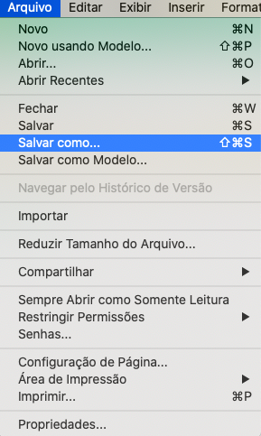
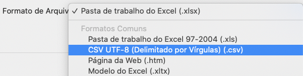
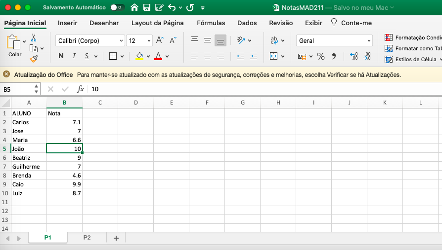

### Introdução

A forma mais fácil de importar dados do Excel é salvando os arquivos como .csv e depois importando esse _dataset_ como usual.


<center>

```{r echo=FALSE, out.width = '30%'}

```


```{r echo=FALSE, out.width = '50%'}

```

</center>


> Contudo, fazer isso não sempre é confortável (e se tiver muitos arquivos pode ser um pouco tedioso). Por isso, existem várias formas de importar os dados em excel, aqui veremos apenas duas formas.

### O pacote readxl

O pacote `readxl` é uma ótima forma de importar dados em formato `.xls` ou `.xlsx`. Se quisermos importar um arquivo `.xls` utilizamos a função `read_xls()`, já se o arquivo tem  extensão `.xlsx` utilizamos a função `read_xlsx()`.

```{r, eval = FALSE}
library(readxl)
arquivo_xls <- read_xls("nome_do_arquivo.xls")
arquivo_xlsx <- read_xlsx("nome_do_outro_arquivo.xlsx")
```

Se tivermos um arquivo com várias abas, basta utilizar o argumento  `sheet` (disponível em ambas as funções). 

No seguinte exemplo, utilizaremos o arquivo `NotasMAD211.xls`, que contem duas abas (uma chamada P1 e outra chamada P2).

<center>

```{r echo=FALSE, out.width = '80%'}

```

</center>

```{r}
library(readxl)
notas_p1 <- read_xlsx("NotasMAD211.xlsx", sheet = 1)
head(notas_p1)
```


<center>

```{r echo=FALSE, out.width = '80%'}
knitr::include_graphics("tela_xlsx_2.png")
```

</center>


```{r}
notas_p2 <- read_xlsx("NotasMAD211.xlsx", sheet = "P2")
head(notas_p2)
```


O argumento `sheet` permite especificar ou posição da aba (na ordem em que ela aparece no arquivo) ou o nome da aba que queremos importar (o nome precisa estar entre aspas).


### O pacote xlsx

Algumas vezes, os arquivos com os quais trabalhamos estão protegidos por senha. Nesses casos, a função `read.xlsx` do pacote `xlsx` nos ajudará a importar os dados. `read.xlsx` funciona de forma  parecida com as funções `read_xls` e `read_xlsx`.

Vamos supor que o arquivo `NotasMAD211.xlsx` esteja protegido por uma senha e que a senha seja `BatatinhaFrita_123`. 

```{r, eval=FALSE}
library(xlsx)
notas_p2 <- read.xlsx("NotasMAD211.xlsx", sheetIndex = 2, password = "BatatinhaFrita_123")
```

**Pronto!** Os dados estão importados `r emo::ji("cool")`.

#### Observações

- O argumento `sheetIndex` da função `read.xlsx` permite especificar a ordem da aba que queremos importar. Se quiser especificar o nome da aba, basta usar o argumento `sheetName` em lugar de `sheetIndex`.
- **Cuidado** com arquivos de excel com filtros ativos. Já tive problemas carregando arquivos de excel quando tinha filtros ativos, a solução foi remover os filtros antes de importar o arquivo para o excel.


**Happy Coding!**


