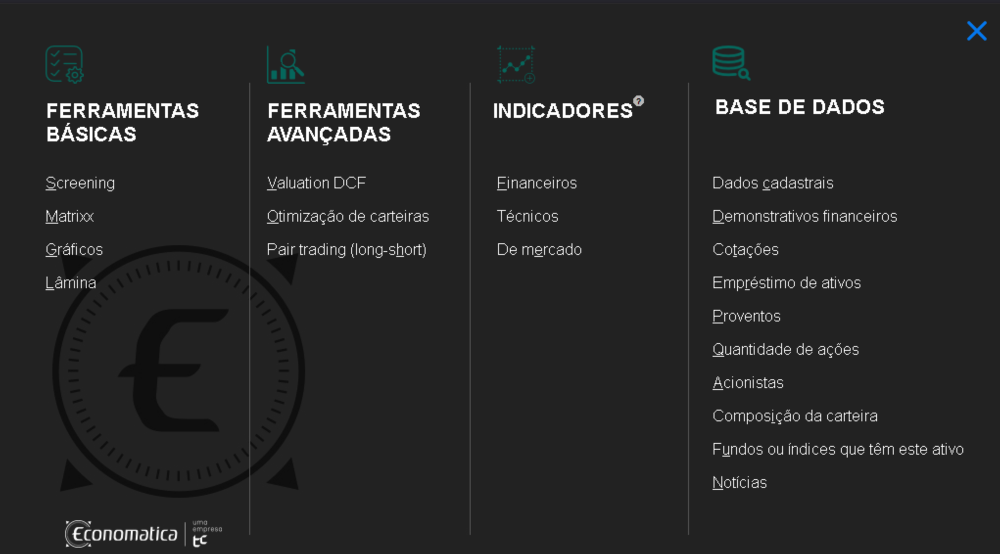

### Introdução


Como muitos de vocês sabem, trabalho com **séries temporais financeiras**, com ênfase em **alocação de carteiras** e na **modelagem e previsão de medidas de risco** (volatilidade, VaR, ES, etc), nos contextos **univariado**, **multivariado** e de **alta dimensão**.

Durante anos, utilizei dados do _Yahoo Finance_ em minhas pesquisas. No entanto, recentemente percebi que esses dados deixaram de ser confiáveis. Em particular, encontrei casos em que os preços de **abertura ou fechamento** estavam **fora do intervalo formado pelos preços mínimo e máximo** (o que obviamente, não faz sentido nenhum).

Motivado por essa limitação, pela necessidade de dados confiáveis para o desenvolvimento dos meus projetos de pesquisa (obrigado à **FAPESP**: 2022/09122-0 e ao **FAEPEX**: PIND 2525/23 pelo suporte financeiro) e também pela [alta demanda de alunos e professores nas áreas de séries temporais, econometria e finanças](https://ime.unicamp.br/carefs/researchers.html), iniciei, junto aos professores **Mauricio Zevallos** e **Luiz Hotta**, com apoio do **IMECC** e do **BIMECC**, um [pedido de aquisição de licenças do Economatica para o IMECC](https://ime.unicamp.br/carefs/news/economatica.html).

O pedido foi aprovado, e desde **outubro de 2024**, a comunidade do IMECC passou a ter acesso a essa base de dados profissional e confiável.


### Computadores liberados

Os acessos são liberados por IP e atualmente os computadores disnponíveis no Laboratório de Séries Temporais, Econometria e Finanças do IMECC (CAREFS), bem como algusn computadores da Biblioteca do IMECC tem os IPs liberados e os usuários podem utilizar os dados nas suas pesquisas, trabalhos acadêmicos ou mesmo apenas por curiosidade.


### Acesso

O acesso à plataforma Economatica é bastante simples. A seguir, apresento um passo a passo detalhado:

0.  **Requisito essencial:** você deve utilizar um computador com IP autorizado.
    * Para os usuários do CAREFS, qualquer computador com conexão cabeada à internet no laboratório já atende a esse requisito.
    * Para quem for acessar a partir da biblioteca, é necessário consultar quais são os computadores liberados para uso.
1.  Acesse o site [www.economatica.com/](https://www.economatica.com/). A seguinte tela será exibida:    

<center>
```{r echo = FALSE, out.width = "55%"}

```
</center>
2.  Clique em **"LOGIN"**. Em seguida, aparecerá esta tela:

<center>
```{r echo = FALSE, out.width = "55%"}

```
</center>

3.  Selecione a opção **"Plataforma"**. Após alguns segundos (ou até um par de minutos de carregamento), a janela principal da ferramenta será aberta:

<center>
```{r echo = FALSE, out.width = "55%"}

```
</center>


> Depois disso, é só aproveitar todos os benfícios que Economatica pode oferecer. No [canal oficial no YouTube da Economatica, há diversos tutoriais disponíveis para te ajudar a aprender a utilizar a plataforma da melhor forma possível.](https://www.youtube.com/@economaticaoficial/playlists).


**Enjoy!**


::: {.callout-notes icon=false}
### Boas práticas

- Tente salvar os arquivos seguindo o padrão: `username_mercado_tipo_frequencia`. Por exemplo, se você estiver montando uma base com os retornos diários das ações que compõem o índice IBRx, o nome do arquivo poderia ser `ctrucios_ibrx_retornos_diarios` (dessa forma, outros usuários buscando os mesmos dados poderão utilizar)


- O arquivo, assim que for aberto, atualizará a base com os dados mais recentes, bastando apenas salvar o arquivo no computador.


- **Se for utilizar um arquivo salvo de outro usuário, apenas abra o arquivo e baixe os dados (mas não altere nenhum parâmetro na construção na base)**!. 

:::

