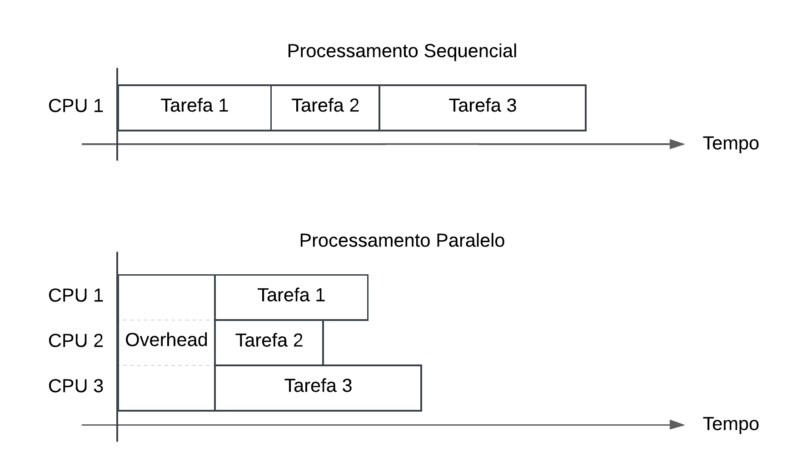
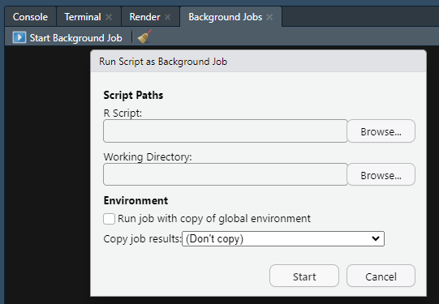

<!-- Configurações iniciais --->
<style>
  body {
    text-align: justify;
  }
</style>

```{r setup, include=FALSE}
# pacotes utilizados
#### modificação na estrutura do documento
library(xaringanExtra)
use_panelset()  # habilitando tabsets do xaringanExtra

#### paralelização
library(future)
library(furrr)
library(doFuture)
library(future.apply)

#### testes
library(tictoc)
library(profvis)
library(microbenchmark)
library(ggplot2)

# chunk options
knitr::opts_chunk$set(echo = TRUE)
```

<!-- Início do Documento --->

# Introdução

É bem sabido por estatísticos, econometristas, cientistas e analistas de dados que, tanto  `R` quanto `Python` não são linguagens particularmente rápidas. Assim, otimizar o desempenho dos códigos torna-se uma parte essencial da rotina de quem trabalha com estas linguagens. Neste post, focaremos na linguagem `R` e no uso de recursos para paralelização.

<aside>
Para quem busca desempenho e praticidade, uma linguagem bastante promissora é `Julia`. Uma excelente iniciativa para começar a aprender essa linguagem é o projeto ["Do Zero ao Julia"](https://ime.unicamp.br/julialang/), que oferece recursos introdutórios em português.
</aside>

> Outro caminho para otimizar o desempenho, além da já famosa vetorização, é através do C++, cuja integração com o  `R` pode ser realizada utilizando o pacote `Rcpp`.


A computação paralela é uma técnica que divide um grande problema em pequenas tarefas, as quais são resolvidas de forma descentralizada podendo ser processadas em vários núcleos de um computador ou entre computadores, normalmente, sendo mais rápido do que processar as tarefas de forma sequencial [@ibm:2024]. A computação paralela é resposta a uma busca por maior velocidade de execução dos `scripts`, motivada pelo interesse em aumentar a eficiência do código em uma era em que modelos cada vez mais complexos são propostos na literatura.

Este post apresenta as algumas das principais formas de paralelizar funções no `R`, além de mostrar como identificar gargalos de processamento e testar alternativas para melhorar a eficiência do código.


# Paralelização

<!-- O que? -->
Por padrão, o R utiliza apenas um núcleo do computador para processar suas tarefas. Paralelização permite a utilização de múltiplos núcleos, diminuindo assim o tempo de processamento.

<!-- Como? -->
A Figura \@ref(fig:paralelizacao) apresenta a ideia de como ocorre a paralelização de processos. Note que, ao utilzarmos processamento em paralelo, existe um tempo chamado de *overhead* que não estava presente no processamento sequencial. *Overhead* refere-se ao tempo necessário para coordenar e gerenciar tarefas tais como a comunicação entre os núcleos, divisão e agregação de tarefas, gerenciamento de memória, entre outros.


```{r paralelizacao, echo=F, out.width='95%', fig.align='center', fig.cap='Conceito da paralelização'}

```


A forma apresentada de paralelização no post abordará 3 dos principais pacotes que utilizam o *framework* do pacote [`future`](https://future.futureverse.org/), sendo eles os pacotes [`furrr`](https://furrr.futureverse.org/), [`doFuture`](https://dofuture.futureverse.org/) e [`future.apply`](https://future.apply.futureverse.org/). É importante mencionar que, além dos pacotes aqui apresentados, existem outros que também podem ser utilizados. 


## O pacote `future`

<a href='https://future.futureverse.org/' target='_blank'>
  
</a>
O pacote [`future`](https://future.futureverse.org/), parte do ecossistema `futureverse`, é um *framework* que unifica e simplifica a paralelização no `R`. Para isso, ele apresenta uma abstração do conceito de atribuição, permitindo o cálculo de valores de forma assíncrona (futura) e resolvidos via *futures*. Existem 4 planos para resolver um *future*:

- `sequential`: resolve *futures* sequencialmente na sessão em utilização do `R`, sendo a forma padrão de funcionamento do `R`;
- `multisession`: resolve *futures* de forma assíncrona e paralelizada gerando, em segundo plano, novas sessões independentes do `R` que se comunicam com o processo principal;
- `multicore`: resolve *futures* de forma assíncrona e paralelizada gerando *forked R processes* que rodam em segundo plano. Não suportado em sistemas Windows;
- `cluster`: resolve *futures* de forma assíncrona e paralelizada em sessões independentes do `R`, normalmente utilizado para duas ou mais máquinas.

Ademais, além de selecionar o plano, também é necessário escolher a quantidade de núcleos (*workers*) a serem utilizados, configurações definidas por meio da função `plan()`. 

> Por exemplo, o comando `plan(multisession, workers = 3)` configura o plano como `multisession` e define a utilização de 3 *workers*.

Além da função `plan()`, as seguintes funções são bastante úteis quando o interesse é paralelizar

- `plan()`: define a estratégia a ser utilizada, além de, ao ser utilizada sem argumentos, retorna a estratégia atual;
- `availableCores()`: retorna a quantidade de núcleos que a máquina tem;
- `nbrOfWorkers()`: retorna a quantidade de *workers* definidos no comando `plan()`;
- `nbrOfFreeWorkers()`: retorna a quantidade de *workers* disponíveis, isto é, os que não estão executando nenhuma tarefa.


Por exemplo, a seguir são apresentadas as configurações sem alteração do número de *workers*, de um dos autores no momento de escrever este post:

```{r}
plan()
availableCores()
nbrOfWorkers()
nbrOfFreeWorkers()
```


## O Pacote `furrr`

<a href='https://furrr.futureverse.org/' target='_blank'>
  
</a>
O pacote [`furrr`](https://furrr.futureverse.org/) busca combinar os comandos e ferramentas de [programação funcional](http://adv-r.had.co.nz/Functional-programming.html) do pacote [`purrr`](https://purrr.tidyverse.org/) com o processamento em paralelo do [`future`](https://future.futureverse.org/). Essa integração possibilita a execução paralela de funções de mapeamento com poucas alterações no código, sendo necessário acrescentar o prefixo `future_` às funções do [`purrr`](https://purrr.tidyverse.org/). Por exemplo, a versão paralela da função `map()` é a `future_map()`, a versão paralela da função `imap()` é a `future_imap()`, e assim por diante.


<!-- Exemplo -->
A seguir, apresentamos um exemplo para ilustrar como utilizar a função `future_map_dbl()` para aplicar a função `log()` nos elementos de um vetor utilizando 2 *workers*:

```{r}
library(furrr)
plan(multisession, workers = 2)  # paralelizar utilizando 2 núcleos

vet <- c(2, exp(1), 10, 20)  # vetor para teste
future_map_dbl(vet, log)
```


Na prática, é comum o uso de funções mais complexas, as quais poderão ser incluidas através de duas formas: (a) por meio de [funções anônimas](http://adv-r.had.co.nz/Functional-programming.html#anonymous-functions), criadas a partir de `function(x) {...}` (ou `\(x) {...}`, para versões superiores ao R 4.1.0) e (b) por medio de uma forma exclusiva do [`furrr`](https://purrr.tidyverse.org/). Para ilustrar isto, veja o exemplo a seguir:


```{r}
# forma 1
f1 <- future_map(vet, \(i) {
  c('log' = log(i), 'quadrado' = i^2)
})

# forma 2 (exclusiva do furrr)
f2 <- future_map(vet, ~ c('log' = log(.x), 'quadrado' = .x^2))

# resultado
identical(f1, f2)  # TRUE
f1  
```


## O Pacote `doFuture`

O pacote [`doFuture`](https://dofuture.futureverse.org/) é outra alternativa para realizar a paralelização de processos. Ele pode ser utilizado de duas formas: a primeira, mais recomendada, é através do operador `%dofuture%`, enquanto a segunda, menos recomendada, é através do operador `%dopar%`.

<!-- Exemplo -->
A seguir, será utilizado o pacote [`doFuture`](https://dofuture.futureverse.org/) para aplicar a função $log()$ nos elementos de um vetor utilizando 2 núcleos e retornar um vetor como saída.

```{r}
library(doFuture)
plan(multisession, workers = 2)  # paralelizar utilizando 2 núcleos

vet <- c(2, exp(1), 10, 20)  # vetor para teste
foreach(i = vet, .combine = c) %dofuture% {
  log(i)
}
```

Vale ressaltar que a saída padrão do `foreach()` é em formato de lista. Contudo, é possível configurá-la por meio do argumento `.combine`, que neste caso foi ajustada para ter um vetor como resultado. Além disso, destaca-se que o `foreach()` **NÃO** é um um for-loop, para mais detalhes, veja [@bengtsson_foreach, Apêndice 8.8].


## O Pacote `future.apply`

O pacote [`future.apply`](https://future.apply.futureverse.org/) estende as funções da base do R que aplicam operações à vetores, matrizes e listas, permitindo a execução de forma paralela com o suporte do *framework* do [`future`](https://future.futureverse.org/). Este pacote fornece versões paralelizáveis de funções da família `apply()` presente na base do R, bastando adicionar o prefixo `future_`.

<!-- Exemplo -->
A seguir, está apresentado como utilizar o pacote [`future.apply`](https://future.apply.futureverse.org/) para aplicar a função $log()$ nos elementos de um vetor utilizando 2 núcleos:

```{r}
library(future.apply)
plan(multisession, workers = 2)  # paralelizar utilizando 2 núcleos

vet <- c(2, exp(1), 10, 20)  # vetor para teste
future_sapply(vet, log)
```

Além do `future_sapply()`, temos também o `future_apply()` e o `future_lapply()`.


# Exemplos Adicionais

Nesta section dois exemplos adicionais serão abordados, o primeiro, relativo à comparação do tempo de execução com e sem paralelização considerando os pacotes apresentados, enquanto o segundo discutirá brevemente a geração de números aleatórios e cuidados necessários ao utilizar em conjunto com a computação paralela.


## Exemplo 1: `slow_sqrt`
Será aplicado a função `slow_sqrt()`, a qual espera 1 segundo e calcula a raiz quadrada do valor de entrada. Além disso, será apresentado o tempo de execução para aplicar essa função em cada elemento de um vetor de tamanho 60 com e sem paralelização.

Primeiro será feito o setup necessário:

```{r setup exemplo 1}
library(future)

plan(multisession, workers = 5)  # paralelizar utilizando 5 núcleos
# função slow_sqrt
slow_sqrt <- function(x) {
  Sys.sleep(1)  # simula 1 segundo de processamento
  sqrt(x)
}

# execução sem paralelização
vet <- 1:60  # vetor para teste
```


A seguir, a comparação utilizando processamento sequencual e as versões em paralelo


```{r}
microbenchmark(M1 = lapply(vet, slow_sqrt), 
               M2 = future_map(vet, slow_sqrt),
               M3 = foreach(i = vet) %dofuture% {
                      slow_sqrt(i)
                    },
               M4 = future_lapply(vet, slow_sqrt), times = 10)
```


## Exemplo 2: Números Aleatórios

Considere as variáveis aleatórias $X_1 \sim \mathcal{N}(0,1)$, $X_2 \sim \mathcal{N}(10, 5)$ e $X_3 \sim \mathcal{N}(50, 8)$. Deverá ser gerado uma amostra com 1000 observações para cada variável aleatória apresentada e calculado o mínimo, média, variância e máximo utilizando $4$ núcleos considerando a *seed* 123.


Primeiro será feito o setup necessário: 

```{r setup exemplo 2}
plan(multisession, workers = 4)  # paralelizar utilizando 4 núcleos

# execução sem paralelização
mu <- c(0, 10, 50)
sigma <- c(1, 5, 8)

set.seed(123)
lapply(1:3, \(i) {
  amostra <- rnorm(1000, mu[i], sigma[i])  # gerando amostra
  c('min'=min(amostra), 'media'=mean(amostra), 'var'=var(amostra), 'max'=max(amostra))
})
```

::::: {.panelset}

::: {.panel}
[furrr]{.panel-name}

```{r furrr exemplo 2}
# forma 1
set.seed(123)
f1 <- future_map(1:3, \(i) {
  amostra <- rnorm(1000, mu[i], sigma[i])  # gerando amostra
  c('min'=min(amostra), 'media'=mean(amostra), 'var'=var(amostra), 'max'=max(amostra))
}, .options = furrr_options(seed = TRUE))

# forma 2 (exclusiva do furrr)
set.seed(123)
f2 <- future_map(1:3, ~ {
  amostra <- rnorm(1000, mu[.x], sigma[.x])  # gerando amostra
  c('min'=min(amostra), 'media'=mean(amostra), 'var'=var(amostra), 'max'=max(amostra))
}, .options = furrr_options(seed = TRUE))

# resultado
identical(f1, f2)

f1
```
:::

::: {.panel}
[doFuture]{.panel-name}

```{r dofuture exemplo 2}
set.seed(123)
foreach(i = 1:3, .options.future = list(seed = TRUE)) %dofuture% {
  amostra <- rnorm(1000, mu[i], sigma[i])  # gerando amostra
  c('min'=min(amostra), 'media'=mean(amostra), 'var'=var(amostra), 'max'=max(amostra))
}
```
:::

::: {.panel}
[future.apply]{.panel-name}

```{r future.apply exemplo 2}
set.seed(123)
future_lapply(1:3, \(i) {
  amostra <- rnorm(1000, mu[i], sigma[i])  # gerando amostra
  c('min'=min(amostra), 'media'=mean(amostra), 'var'=var(amostra), 'max'=max(amostra))
}, future.seed = TRUE)
```
:::

:::::

Veja que o resultado utilizando a paralelização diverge do que foi encontrado ao não utilizá-la. Além disso, note que há um argumento referende à seed em cada função dos pacotes apresentados, por exemplo, para o pacote [`furrr`](https://furrr.futureverse.org/) é utilizado o argumento `.options = furrr_options(seed = TRUE)`. Estes argumentos são responsáveis por manter a reprodutibilidade na geração de números pseudo-aleatórios através do gerador L'Ecuyer-CMRG (utilizado pelo [`future`](https://future.futureverse.org/)), já que o Mersenne-Twister (gerador padrão do R) não foi idealizado para trabalhar com paralelização, podendo gerar números correlacionados entre os *workers*, causando viés e conclusões equivocadas.

Assim, como os geradores são diferentes, o resultado não é o mesmo, contudo, ambos são válidos, isto é, todos são amostras das respectivas normais apresentadas.


# Eficiência de Código

A busca por soluções que diminuem o tempo de processamento computacional (como a computação paralela) vem acompanhadas da preocupação com a sua eficiência. Isto, pois ao se escrever um código mais eficiente, o tempo de execução tende a diminuir. No entanto, nem sempre vale a pena investir tempo na otimização prematura do código. Antes disso, é fundamental avaliar cuidadosamente se esse esforço é realmente necessário [@selina:2023]:

- Quanto tempo é salvo pela otimização?
- Qual a frequência que este código é executado?
- Quanto tempo será necessários para otimizar o código?


Aassumindo que é necessária a otimização no código, torna-se importante detectar quais as linhas que mais consomem tempo. Para isso, ferramentas bastantes úteis são os pacotes [`profvis`](https://profvis.r-lib.org/index.html) para detecção do gargalo no processamento e [`microbenchmark`](https://www.rdocumentation.org/packages/microbenchmark/versions/1.5.0/topics/microbenchmark) para testar tempo de processamento de diversas alternativas, como realizado no exemplo 1. 


**Importante: ** algumas boas práticas que podem ajudar a reduzir o tempo de processamento [@selina:2023]:

- Quando necessário, armazenar resultados intermediários constatemente utilizados para evitar o recálculo;
- Preferir vetorizar o código e substituir for-loops por funções vetorizadas;
- Não paralelizar processos muito simples devido ao *overhead*;
- Evitar manipular objetos grandes na paralelização.


## Profiler

Para identificar as partes críticas do código, isto é, o gargalo do processamento pode-se utilizar o pacote [`profvis`](https://profvis.r-lib.org/index.html), o qual examina o tempo gasto em cada função de determinada parte do script. Seu acesso se dá por `Profile > Start Profiling` (e `Profile > Stop Profiling` para finalizar) na barra de ferramentas do Rstudio ou através da função `profvis()`.

<!-- exemplo profvis -->
Veja um exemplo abaixo (adaptado de @profvis):

<!-- ATENÇÃO COM ESTE CHUNK-->
<!-- ATENÇÃO COM ESTE CHUNK-->
<!-- ATENÇÃO COM ESTE CHUNK-->
```{r run_before_compile_1, echo=F, eval=F}
##################  !!!  IMPORTANTE  !!!  ####################
## Este chunk precisa ser executado manualmente antes de    ##
## compilar o documento caso tenha sofrido alguma alteração ##
## ou se o seu arquivo não existe na pasta profiler/        ##
##############################################################

library(profvis)

# funções
h <- function() {
  pause(0.1)
}

g <- function() {
  pause(0.1)
  h()
}

f <- function() {
  pause(0.1)
  g()
  h()
}

# profiler
p <- profvis({
  f()
  g()
})

# verificando pasta profiler
if (!dir.exists('profiler')) {
  dir.create('profiler')
}

# salvando widget profiler
htmlwidgets::saveWidget(p, './profiler/profvis_1.html')
```


```{r verificando, echo=F}
# verificando existencia ddo arquivo profvis_1.html
if (!file.exists('./profiler/profvis_1.html')) 
  stop('Compile manualmente o chunk run_before_compile_1 antes de compilar o
       documento.')
```


```{r, eval=F}
library(profvis)

# funções
h <- function() {
  pause(0.1)
}

g <- function() {
  pause(0.1)
  h()
}

f <- function() {
  pause(0.1)
  g()
  h()
}

# profiler
profvis({
  f()
  g()
})
```

<iframe src='./profiler/profvis_1.html' height='400'></iframe>

Sua análise está dividida em duas abas, a primeira, *flame graph*, é apresentado o tempo e memória gastos em cada linha de código em conjunto com uma timeline das funções utilizadas e, a segunda, *Data*, apresenta o tempo gasto em cada função.


## Benchmark

Por último, o mesmo código pode ser escrito de várias formas diferentes, sendo necessário determinar qual delas é a mais rápida. Para isso existe o pacote [`microbenchmark`](https://www.rdocumentation.org/packages/microbenchmark/versions/1.5.0/topics/microbenchmark), o qual auxilia na comparação entre as versões do mesmo código de forma sistematizada.

Considere comparar 3 funções diferentes cujo objetivo é calcular a soma de um vetor aplicando o logarítimo em cada elemento. A primeira, utiliza funções vetorizadas, a segunda e a terceira aplicam os comandos elemento à elemento, contudo, uma já aloca a memória necessária criando o vetor `x_log` do seu tamanho final, o que é mais eficiente.

```{r microbenchmark}
library(microbenchmark)

# funções
f1 <- function(x) {  # utilizando funções vetorizadas
  x_log <- log(x)
  sum(x_log)
}

f2 <- function(x) {  # criando vetor do tamanho final (pré-alocando memória)
  x_log <- vector(mode = 'numeric', length = length(x))  # tamanho final
  for (i in 1:length(x)) {
    x_log[i] <- log(x[i])
  }
  sum(x_log)
}

f3 <- function(x) {  # utilizando o comando append() (ineficiente)
  x_log <- vector(mode = 'numeric', length = 0)  # tamanho 0
  for (i in x) {
    x_log <- append(x_log, log(i))
  }
  sum(x_log)
}

# vetor para teste 
vet <- sample(1:10, size = 3500, replace = TRUE)

# benchmark
comp <- microbenchmark(
  'forma 1' = f1(vet),
  'forma 2' = f2(vet),
  'forma 3' = f3(vet)
)

# resultado
comp  

# plot do resultado
library(ggplot2)
autoplot(comp)
```


Então, veja que a *forma 1*, isto é, a função `f1()`, é a mais eficiente (resultado esperado, afinal funções vetorizadas no R são mais eficientes que for-loops). Além disso, veja que a *forma 2* se sobressai referente à *forma 3*, haja vista que o vetor para armazenar o resultado `x_log` já é criado com o seu tamanho final, enquanto que a *forma 3* fica acrescentando ao final do vetor (na verdade o R faz uma cópia do objeto e faz o acréscimo do novo valor, logo, quanto maior for o objeto pior será o desempenho dessa proposta).


# Comentários Finais


1. Existe a alternativa de executar código como um *background job*. Para fazer isso no Rstudio basta buscar a aba de *background job* (Figura \@ref(fig:background-jobs)), selecionar o script e o diretório de trabalho e iniciar. Com isso, o script será executado em uma nova sessão, deixando o terminal disponível para utilização mesmo durante sua execução.

```{r background-jobs, echo=F, out.width='80%', fig.align='center', fig.cap='*Background jobs* no Rstudio'}

```

2. Uma estratégia interessante é escrever parte do código em C++ (através do pacote `Rcpp`) e paralelizar com, por exemplo, `future_apply()` (que é uma das formas mais fáceis aqui apresentadas). Infelizmente, as tentativas previas realizadas por um dos autores não foram satisfatórias. Uma solução foi utilizar o função `mclapply()` do pacote `parallel`.


3. A maior parte deste post foi escrita pelo primeiro autor, João Victor Siqueira Rodrigues, a pedido do segundo autor. Este último realizou pequenas modificações no texto original e acrescentou pequenos comentários. O Segundo autor agradece a João Victor pela disponibilidade e colaboração na elaboração de um conteúdo que, certamente, será útil para seus colegas.


**Happy Coding!**