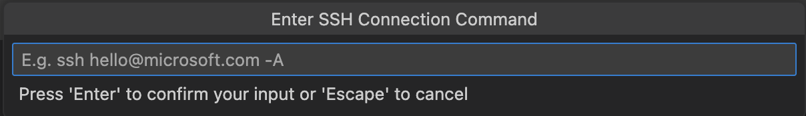
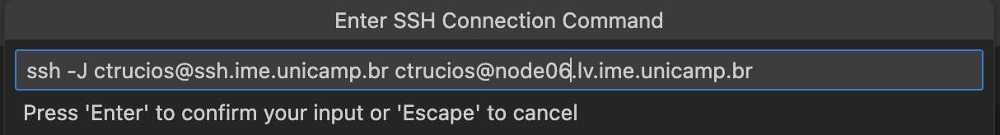
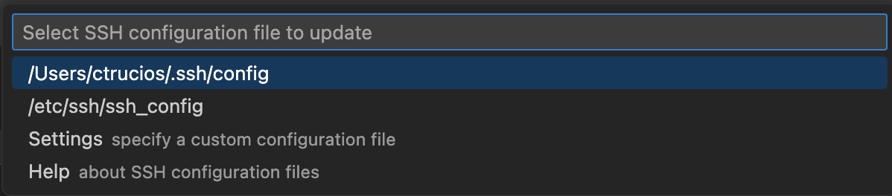
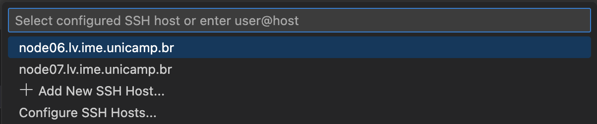
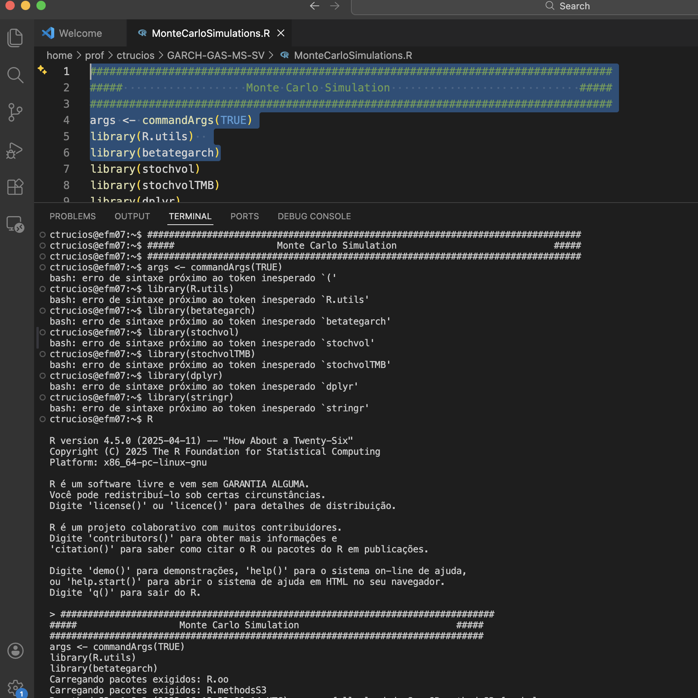

### Introdução

No [CAREFS](https://ime.unicamp.br/carefs), assim como no
[laboratório virtual do IMECC](https://ime.unicamp.br/informatica/laboratorio-virtual),
é comum deixarmos **simulações de grande porte** ou **trabalhos empíricos**
rodando por dias.

Uma forma tradicional de fazer isto, é desenvolver tudo na máquina local, enviar o código
para a nossa unidade *H* e executar o script remotamente, por exemplo, através da seguinte forma:

- Abrir o terminal, se logar no SSH do IMECC, se logar no SSH do `node`

```{bash}
#| eval: false
ssh ctrucios@ssh.ime.unicamp.br
```

```{bash}
#| eval: false
ssh ctrucios@node06.lv.ime.unicamp.br
```

- Rodar o código, com, por exemplo:

```{bash}
#| eval: false
R CMD BATCH nome_do_meu_codigo.R &
```
ou
```{bash}
#| eval: false
nohup julia nome_do_seu_arquivo.jl outfile_name.txt &
```

Após um tempo rodando, veremos se nosso protótipo roda sem erro no servidor. No entanto, e se pudéssemos fazer o último teste do código **diretamente no ambiente remoto**, garantindo que tudo está funcionando exatamente como esperado antes de lançar uma execução longa?

### Configurando o VS Code

#### Pré-requisitos
- Instalar o `VS Code`
- Instalar a extensão `Remote – SSH`

#### Configuração

Pressione `F1` ou `fn + F1` (se estiver no Mac) e selecione a opção  
`Remote-SSH: Add New SSH Host...` (na imagem abaixo aparece como segunda opção).

<center>

</center>


Em seguida, aparecerá uma caixa de diálogo para inserir o endereço SSH da máquina à qual deseja se conectar.


<center>

</center>

No **CAREFS**, o acesso é feito conectando-se primeiro via SSH ao **IMECC** e, em seguida, a um dos *nodes*. Isso pode ser realizado com o seguinte comando:

```bash
#| eval: false
ssh -J usuario@ssh.ime.unicamp.br usuario@node06.lv.ime.unicamp.br
```


<center>

</center>

<aside>
Substitua `ctrucios` pelo seu nome de usuário e `node07` pelo node que deseja utilizar
</aside>


Após inserir o comando, será solicitado que você salve a nova configuração.


<center>

</center>


Com a configuração salva, basta conectar-se ao node desejado:

- Pressione `F1`
- Selecione `Remote-SSH: Connect to Host...`
- Escolha o host configurado anteriormente


<center>

</center>

(no meu caso, como pode-se ver na imagem, tenho configurado os nodes 6 e 7)

<center>

</center>


(o sistema pedirá sua senha duas vezes, e se for a primeira vez que entra, criará un `finger print`)


<center>

</center>

Depois, o VS Code abrirá normalmente e você poderá escolher entre abrir um arquivo ou criar um novo (como usual).


<center>

</center>


Por exemplo, eu abri um arquivo de uma simulação (`MonteCarloSimulations.R`), aperto `Shift + Enter` para rodar o código selecionado e pronto...**vai dar erro!**

<center>

</center>

> **Observação:** o terminal está no `bash`, é necessário abrir o `R` primeiro para não dar erro como na imagem anterior.


<center>

</center>


**Pronto**, agora pode editar código no VS Code e rodar tudo no `node`.

**Happy Coding!**
