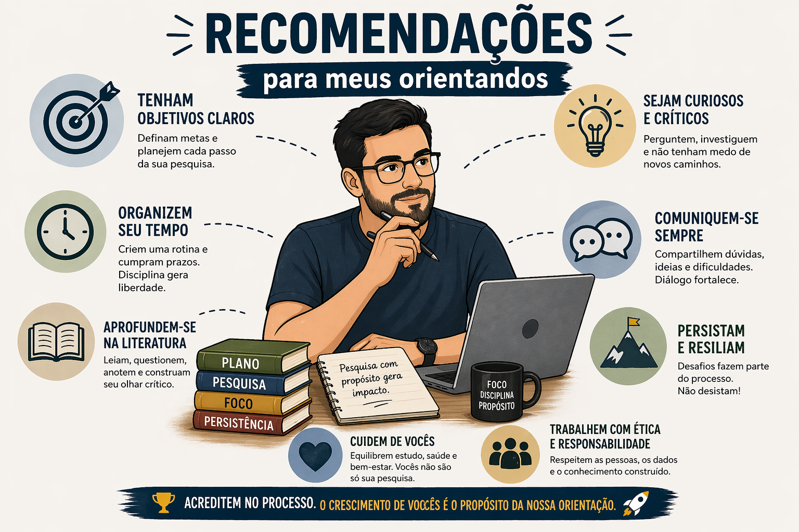

Olá! Se você está lendo isto, é porque:

- estamos prestes a iniciar (ou você tem interesse em iniciar) uma parceria de pesquisa;  ou
- você já é meu aluno e estamos desenvolvendo algum projeto juntos.

Independentemente do caso, espero que este material nos ajude a aproveitar ao máximo o tempo em que trabalharemos em conjunto. A seguinte lista de recomendações foi elaborada visando tornar nossa colaboração mais produtiva, organizada e enriquecedora.


### 1. Autonomia e Responsabilidade

- **O projeto é seu:** Eu não escrevo projetos para alunos. Definiremos o tema juntos, alinhando seus interesses à minha experiência. Você escreve, eu reviso e iteramos. Nada funciona melhor do que um pesquisador motivado. Por isso, quero que você trabalhe em algo de que **você** realmente goste.
- **Protagonismo:** O trabalho é de sua inteira responsabilidade. Eu sou o orientador, não o executor. Estarei sempre disponível para ajudar e orientar, mas não farei o trabalho por você.
- **Tenha iniciativa:** Não espere sempre instruções. Apresente ideias, proponha caminhos e busque soluções.
- **Gestão de Tempo:** Não deixe nada para a última hora. Imprevistos acontecem, então tenha tudo pronto bem antes do prazo.
- **Prazos:** Os prazos também são da sua responsabilidade. Organize-se: registre datas importantes (relatórios, submissões, reuniões) e use lembretes (alarmes faltando uma semana funcionam bastante bem comigo).
- **Revisão:** Envie textos para revisão com antecedência. Assim, terei tempo para ler com atenção e devolver o documento com sugestões (lembre-se: você não é meu único aluno(a), orientação não é minha única atividade e professor também é gente).


### 2. Reuniões de orientação

- **Use anotações:** Durante nossa reuniões, anote os pontos discutidos (isso evita retrabalho e perda de informações importantes).
- **Códigos atualizados:** Sempre leve às reuniões a versão mais atualizada dos códigos (de preferência, coloque eles sempre no GitHub). Não consigo ajudar com bugs sem acesso ao código.
- **Fique atento:** Fique atento à frequência das suas reuniões (semanal ou quinzenal) e, se por algum motivo não for comparecer, avise o quanto antes.


### 3. Rigor Técnico e Reprodutibilidade

- **Código:** Pode usar a linguagem de programação que preferir, mas saiba que se for `R` ou `Julia`, poderei lhe ajudar melhor.
- **Versionamento:** Aprenda a utilizar Git, GitHub e mantenha seus códigos organizados. Ao submeter artigos, disponibilizaremos os códigos.
- **Boas Práticas:** Adote boas práticas de programação (veja esses materiais para [Julia](https://github.com/JuliaDiff/BlueStyle) ou [R](https://style.tidyverse.org/syntax.html)), priorizando clareza, organização e documentação. Lembre-se: outras pessoas e o seu _futuro eu_ devem ser capazes de entender e reproduzir o seu código.
- **Backup:** Sempre que possível, utilize _Overleaf_, _GitHub_, etc. Se não costuma usar essas ferramentas, mantenha cópias frequentes do seu trabalho (fazer um backup antes de dormir, é uma boa ideia).
- **Um bom amigo:** O `set.seed()` ($\equiv$ `Random.seed!`) é sempre um bom amigo nas nossas pesquisas. Então, sempre que apropriado, inclua ele.


### 4. Comunicação e Escrita

- **Idioma:** Artigos acadêmicos devem ser escritos em **inglês**. Relatórios/Propostas CNPq, FAPESP e PIBIC devem ser escritos em **português**.
- **Qualidade do Texto:** Um texto mal escrito compromete a credibilidade da pesquisa. Escreva de forma clara e auto-contida ao ponto que o leitor possa entender e implementar sua proposta.
- **Uso de IA:** Ferramentas de IA são permitidas para auxílio, mas devem ser **declaradas explicitamente**. Elas não substituem seu pensamento crítico nem seu trabalho como pesquisador. Um bom uso da IA seria para polir o texto e corrigir a gramática.
- **Gráficos:** Gráficos devem ser elaborados de tal forma que, apenas "batendo o olho", os primeiros _insights_ apareçam (seja criativo mas busque clareza e objetividade nos gráficos).
- **Tabelas:** Capriche na formatação de tabelas, elas devem ser apresentadas de forma que seja fácil fazer comparações e analisar os resultados. Saiba que ao longo da pesquisa, tabelas serão feitas e refeitas com muita frequência, por isso, evite trabalho manual e automatize a criação de tabelas (pacotes como o `xtable`e `kableExtra` são bem uteis)
- **O "Descanso":** Antes de entregar uma "versão final", deixe o texto descansar por alguns dias e faça uma revisão final com "olhos frescos".


### 5. Ética e Mentalidade de Pesquisa

- **Integridade Inegociável:** Nunca ajuste resultados para que pareçam "melhores".
- **IA:** Nunca, sob hipótese alguma, me envie um documento feito 100% com IA (escrever projetos, artigos e relatórios por si próprio é parte do seu processo de aprendizado). De forma semelhante, nunca me envie textos passados pela IA sem antes você ter lido e revisado com olhar crítico.
- **Documentação Total:** Registre decisões metodológicas e até tentativas que falharam. Isso evita o retrabalho.
- **Leitura Constante:** Pesquisa é leitura. Mantenha-se sempre atualizado através de literaturas referentes à área do seu projeto.
- **Comunicação:** Saber explicar seu trabalho (em apresentações ou conversas) é tão importante quanto a execução técnica.


### 6. Equilíbrio e Saúde

- **Cuide da sua saúde mental e física**. Faça exercícios, cultive hobbies e mantenha relações fora da universidade. Um pesquisador exausto não é um pesquisador eficiente.
- Eu estou aqui para lhe ajudar, então confie em mim (mesmo quando fez um erro _bobo_, saiba que pode me contar). Só consigo lhe ajudar se souber o que realmente aconteceu.

<br>

<center>
_Meu objetivo como orientador não é apenas ajudar você a concluir um trabalho, mas formar um pesquisador independente, crítico e ético._
</center>

<br><br>

```{r, echo=FALSE, fig.align='center'}

```

> Ferramentas de IA foram utilizadas para aprimoramento de texto, correção ortográfica, diagramação e criação da figura ilustrativa.
